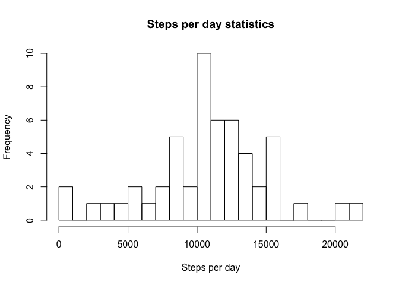
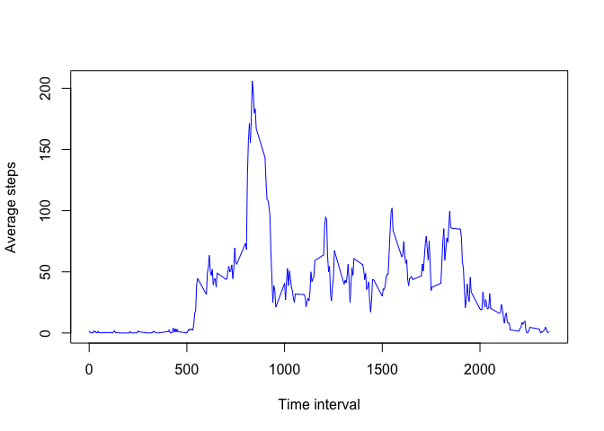
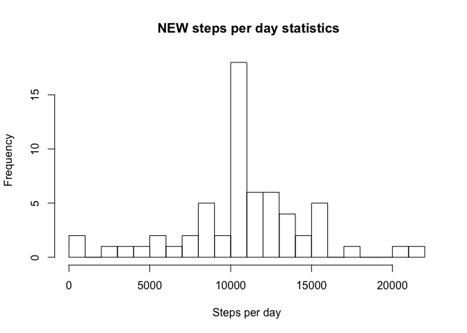
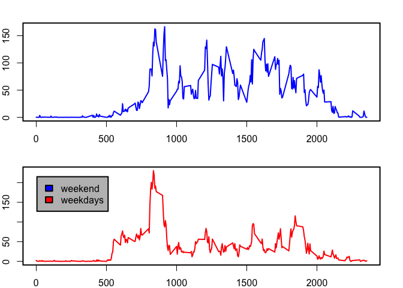

## Loading and preprocessing the data
Unzip data, read the table and first look to the data.


```r
unzip("activity.zip")
file_path = "./activity.csv"
activity = read.csv(file_path, sep = ",")
head(activity)
```

```
##   steps       date interval
## 1    NA 2012-10-01        0
## 2    NA 2012-10-01        5
## 3    NA 2012-10-01       10
## 4    NA 2012-10-01       15
## 5    NA 2012-10-01       20
## 6    NA 2012-10-01       25
```


## What is mean total number of steps taken per day?

1.Calculating the total number of steps taken per day

```r
list_of_the_days<-levels(activity$date)
s<-1:20

  for (i in 1:length(list_of_the_days)) {
  s[i] <- sum(subset(activity, date==list_of_the_days[i])$steps)
                          }
total_steps<- cbind(date=list_of_the_days, steps=s)
head(total_steps)
```

```
##      date         steps  
## [1,] "2012-10-01" NA     
## [2,] "2012-10-02" "126"  
## [3,] "2012-10-03" "11352"
## [4,] "2012-10-04" "12116"
## [5,] "2012-10-05" "13294"
## [6,] "2012-10-06" "15420"
```

2. Making a histogram of the total number of steps taken each day

```r
hist(as.numeric(total_steps[,2]),breaks = 20, main = "Steps per day statistics", xlab = "Steps per day")
```

<!-- -->

1. Calculating the mean and median of the total number of steps taken per day


```r
mean_steps<-1:20
median_steps<-1:20

for (i in 1:length(list_of_the_days)) {
  mean_steps[i] <- mean(as.numeric(subset(activity, date==list_of_the_days[i])$steps), na.rm = TRUE)
  median_steps[i] <- median(as.numeric(subset(activity, date==list_of_the_days[i])$steps), na.rm = TRUE)
  
                          }
total_steps<- data.frame(total_steps, mean=mean_steps, median=median_steps)
total_steps[1:10,]
```

```
##          date steps     mean median
## 1  2012-10-01  <NA>      NaN     NA
## 2  2012-10-02   126  0.43750      0
## 3  2012-10-03 11352 39.41667      0
## 4  2012-10-04 12116 42.06944      0
## 5  2012-10-05 13294 46.15972      0
## 6  2012-10-06 15420 53.54167      0
## 7  2012-10-07 11015 38.24653      0
## 8  2012-10-08  <NA>      NaN     NA
## 9  2012-10-09 12811 44.48264      0
## 10 2012-10-10  9900 34.37500      0
```


## What is the average daily activity pattern?
Make a time series plot (i.e. \color{red}{\verb|type = "l"|}type="l") of the 5-minute interval (x-axis) and the average number of steps taken, averaged across all days (y-axis)


```r
list_of_the_intervals<-subset(activity, date==list_of_the_days[1])$interval

average_steps<-1:20

for (i in 1:length(list_of_the_intervals)) {
average_steps[i]<-mean(subset(activity, interval==list_of_the_intervals[i])$steps, na.rm=TRUE)
  }
average_steps<-data.frame(steps=average_steps, interval=list_of_the_intervals)
with(average_steps, plot(interval, steps, type = "l", xlab = "Time interval", ylab = "Average steps", col="blue"))
```

<!-- -->

Which 5-minute interval, on average across all the days in the dataset, contains the maximum number of steps?

```r
maximum_interval<-subset(average_steps,steps==max(average_steps$steps))$interval
print(maximum_interval)
```

```
## [1] 835
```


## Imputing missing values
1.Calculate and report the total number of missing values in the dataset (i.e. the total number of rows with \color{red}{\verb|NA|}NAs)

```r
length(which(is.na(activity$steps)))
```

```
## [1] 2304
```

2. Devise a strategy for filling in all of the missing values in the dataset. The strategy does not need to be sophisticated. For example, you could use the mean/median for that day, or the mean for that 5-minute interval, etc.

```r
#Filling of the missing values by mean for that 5-minute interval
na_rows<-which(is.na(activity$steps))

for (i in 1:length(na_rows)) 
{activity[na_rows[i],1]<-mean(subset(activity, interval==activity$interval[na_rows[i]])$steps, na.rm = TRUE)}

head(activity)
```

```
##       steps       date interval
## 1 1.7169811 2012-10-01        0
## 2 0.3396226 2012-10-01        5
## 3 0.1320755 2012-10-01       10
## 4 0.1509434 2012-10-01       15
## 5 0.0754717 2012-10-01       20
## 6 2.0943396 2012-10-01       25
```

3. Create a new dataset that is equal to the original dataset but with the missing data filled in.

```r
new_file_path = "./new_activity.csv"
write.csv(activity, new_file_path)
```

4.Make a histogram of the total number of steps taken each day  


```r
  for (i in 1:length(list_of_the_days)) {
  s[i] <- sum(subset(activity, date==list_of_the_days[i])$steps)
                          }
total_steps<- data.frame(date=list_of_the_days, steps=s)
hist(as.numeric(total_steps[,2]),breaks = 20, main = " NEW steps per day statistics", xlab = "Steps per day")
```

<!-- -->
and Calculate and report the mean and median total number of steps taken per day.

```r
for (i in 1:length(list_of_the_days)) {
  mean_steps[i] <- mean(as.numeric(subset(activity, date==list_of_the_days[i])$steps))
  median_steps[i] <- median(as.numeric(subset(activity, date==list_of_the_days[i])$steps))
  }
total_steps<- data.frame(total_steps, mean=mean_steps, median=median_steps)
total_steps[1:10,]
```

```
##          date    steps     mean   median
## 1  2012-10-01 10766.19 37.38260 34.11321
## 2  2012-10-02   126.00  0.43750  0.00000
## 3  2012-10-03 11352.00 39.41667  0.00000
## 4  2012-10-04 12116.00 42.06944  0.00000
## 5  2012-10-05 13294.00 46.15972  0.00000
## 6  2012-10-06 15420.00 53.54167  0.00000
## 7  2012-10-07 11015.00 38.24653  0.00000
## 8  2012-10-08 10766.19 37.38260 34.11321
## 9  2012-10-09 12811.00 44.48264  0.00000
## 10 2012-10-10  9900.00 34.37500  0.00000
```
  Do these values differ from the estimates from the first part of the assignment?  
*No, mean and median values is absolutely the same, but we excluded the NA values from the table*  
What is the impact of imputing missing data on the estimates of the total daily number of steps?
*Maximum of total daily numbers is higher and the hole histogram is sharper*


## Are there differences in activity patterns between weekdays and weekends?
1. Create a new factor variable in the dataset with two levels – “weekday” and “weekend” indicating whether a given date is a weekday or weekend day.


```r
activity<-cbind(activity, weekdays=weekdays(as.Date(activity$date)))
all_weekdays_levels<-levels(activity$weekdays)
all_weekdays_labels<-1:5

for (i in 1:length(all_weekdays_levels)) 
{ if (all_weekdays_levels[i]=="Saturday")
        all_weekdays_labels[i]<-"weekend"
else if (all_weekdays_levels[i]=="Sunday")
        all_weekdays_labels[i]<-"weekend"
else
        all_weekdays_labels[i]<-"weekday"
}
activity$weekdays<-factor(activity$weekdays, levels = all_weekdays_levels, labels = all_weekdays_labels)
summary(activity)
```

```
##      steps                date          interval         weekdays    
##  Min.   :  0.00   2012-10-01:  288   Min.   :   0.0   weekday:12960  
##  1st Qu.:  0.00   2012-10-02:  288   1st Qu.: 588.8   weekend: 4608  
##  Median :  0.00   2012-10-03:  288   Median :1177.5                  
##  Mean   : 37.38   2012-10-04:  288   Mean   :1177.5                  
##  3rd Qu.: 27.00   2012-10-05:  288   3rd Qu.:1766.2                  
##  Max.   :806.00   2012-10-06:  288   Max.   :2355.0                  
##                   (Other)   :15840
```

2.Make a panel plot containing a time series plot (i.e. \color{red}{\verb|type = "l"|}type="l") of the 5-minute interval (x-axis) and the average number of steps taken, averaged across all weekday days or weekend days (y-axis). 


```r
activity_weekday<-subset(activity, weekdays=="weekday")
activity_weekend<-subset(activity, weekdays=="weekend")

average_steps_weekday<-1:5
average_steps_weekend<-1:2
for (i in 1:length(list_of_the_intervals)) {
        average_steps_weekday[i]<-mean(subset(activity_weekday, interval==list_of_the_intervals[i])$steps)
        average_steps_weekend[i]<-mean(subset(activity_weekend, interval==list_of_the_intervals[i])$steps)
}

average_steps_weekday<-data.frame(steps=average_steps_weekday, interval=list_of_the_intervals)
average_steps_weekend<-data.frame(steps=average_steps_weekend, interval=list_of_the_intervals)

old.par<-par(no.readonly = TRUE)
par(mar=rep(2,4), mfrow=c(2,1), lwd=2)

with(average_steps_weekend, plot(interval, steps, type = "l", xlab = "Time interval", ylab = "Average weekend steps", col="blue"))
with(average_steps_weekday, plot(interval, steps, type = "l", xlab = "Time interval", ylab = "Average weekday steps", col="red"))
legend(x=5, y =215, legend = c("weekend","weekdays"), fill=c("blue","red"), bg="gray")
```

<!-- -->

```r
#Return default par()
par(old.par)
```
